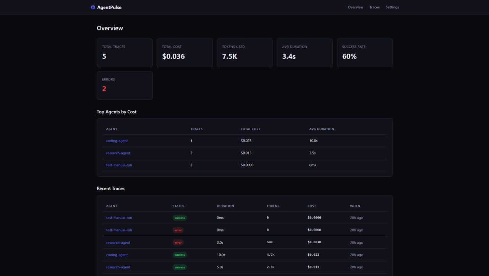
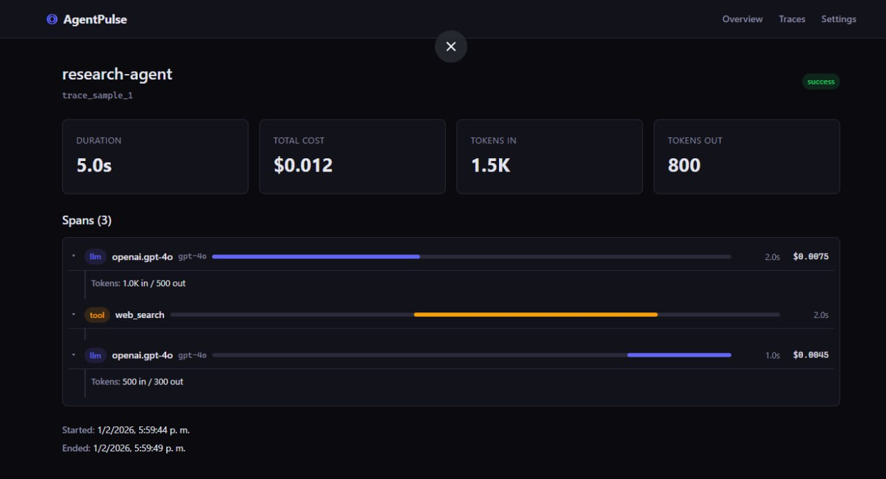

[](https://pypi.org/project/agentpulse-ai/)
[](https://opensource.org/licenses/MIT)
[](https://www.python.org/downloads/)
[](https://codespaces.new/nandusmasta/agentpulse?quickstart=1)

# AgentPulse

Lightweight, framework-agnostic observability for AI agents. Track costs, tokens, traces, and latency across OpenAI, Anthropic, and any custom tooling — with a self-hostable dashboard.

## 🚀 Try It Now

### Option 1: One-Click Cloud Environment (Recommended for trying)

[](https://codespaces.new/nandusmasta/agentpulse?quickstart=1)

Click the button above → wait ~2 minutes → dashboard opens automatically. No installation needed!

### Option 2: One-Line Install (For local use)

```bash
curl -fsSL https://raw.githubusercontent.com/nandusmasta/agentpulse/main/install.sh | bash
```

This installs everything and starts AgentPulse locally. Dashboard at `http://localhost:5173`.

### Option 3: Manual Setup

```bash
# Install SDK
pip install agentpulse-ai

# Clone and run services
git clone https://github.com/nandusmasta/agentpulse.git
cd agentpulse
docker-compose up -d
```

## Quick Start

Once running, add observability to your agent with 3 lines:

```python
from agentpulse import AgentPulse, trace, tool

ap = AgentPulse(endpoint="http://localhost:3000", api_key="ap_dev_default")

@tool
def search(query: str) -> str:
    return f"Results for {query}"

@trace(name="research-agent")
def run_agent(topic: str):
    result = search(topic)
    return result

run_agent("quantum computing")
ap.shutdown()
```

Traces, spans, token counts, and costs are sent to the collector and visible in the dashboard.

## Screenshots

<p align="center">
  
</p>

<p align="center">
  
</p>

## Features

- **Decorator-based tracing** — `@trace` and `@tool` decorators with zero boilerplate
- **Auto-patching for LLMs** — automatic instrumentation for OpenAI and Anthropic clients
- **Cost tracking** — per-call and aggregate cost calculation for 9+ models
- **Span tree visualization** — hierarchical trace view in the dashboard
- **Self-hostable** — your data stays on your machine
- **Zero dependencies** — the SDK uses only the Python standard library
- **Async support** — works with both sync and async code
- **Batch transport** — low-overhead background flushing

## Screenshots


## Auto-Instrumentation

Patch OpenAI or Anthropic clients to automatically capture every LLM call:

```python
from openai import OpenAI
from agentpulse import AgentPulse

ap = AgentPulse(api_key="ap_dev_default")
client = OpenAI()
ap.patch_openai(client)

# All chat completion calls are now traced automatically
response = client.chat.completions.create(
    model="gpt-4o",
    messages=[{"role": "user", "content": "Hello"}],
)
```

## Architecture

```
SDK (Python) → Collector API → SQLite → Dashboard
```

| Component | Tech | Port |
|-----------|------|------|
| SDK | Python 3.10+ | — |
| Collector | Bun + Hono | 3000 |
| Dashboard | SvelteKit | 5173 |

## Documentation

- [Quick Start](docs/quickstart.md)
- [Self-Hosting Guide](docs/self-hosting.md)
- [SDK Reference](docs/sdk-reference.md)
- [Examples](examples/)
- [Contributing](CONTRIBUTING.md)

## Why AgentPulse?

| Problem | AgentPulse Solution |
|---------|---------------------|
| "My agent cost $400 last month, but which calls?" | Per-trace cost breakdown |
| "Agent failed, no idea why" | Full span tree with inputs/outputs |
| "LangSmith requires LangChain" | Framework-agnostic, works with anything |
| "Don't want my data on someone's server" | Self-host with SQLite, data stays local |
| "Existing tools are expensive" | Free & open source forever |

## Community

- **Discord**: [Join us](https://discord.gg/agentpulse)
- **Issues**: [GitHub Issues](https://github.com/nandusmasta/agentpulse/issues)
- **Discussions**: [GitHub Discussions](https://github.com/nandusmasta/agentpulse/discussions)

Need help? Open an issue — we respond quickly!

## Contributing

See [CONTRIBUTING.md](CONTRIBUTING.md) for development setup and guidelines.

## License

[MIT](LICENSE)
